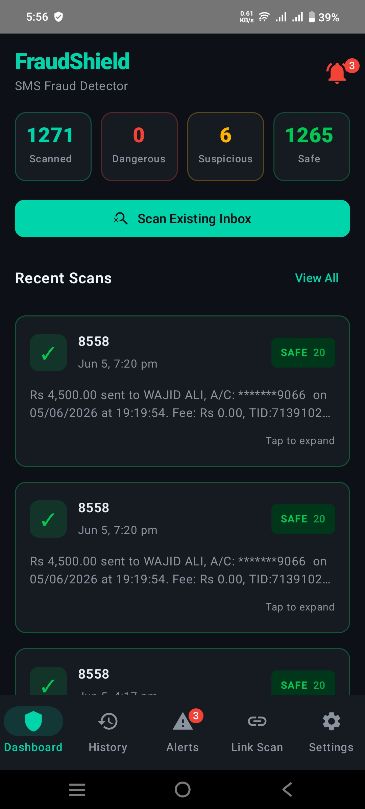
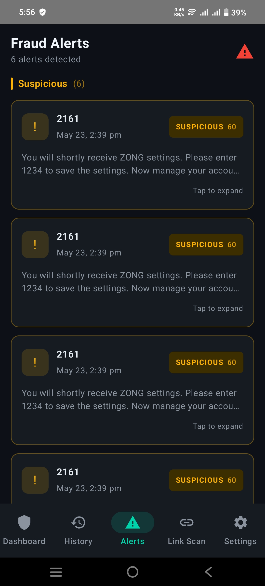
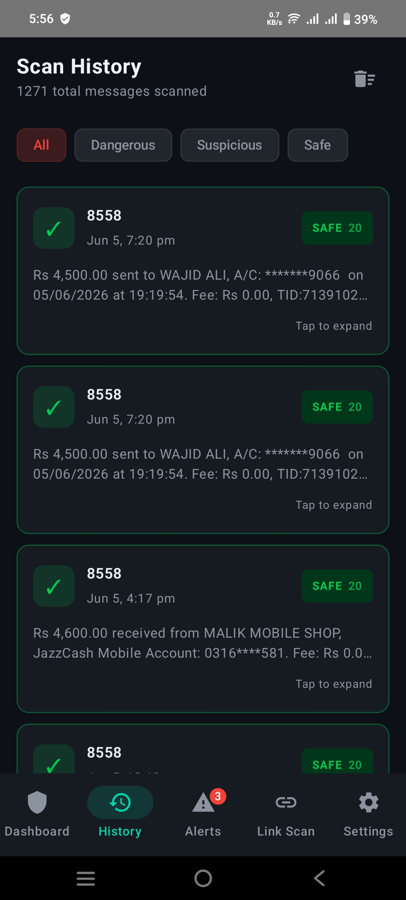
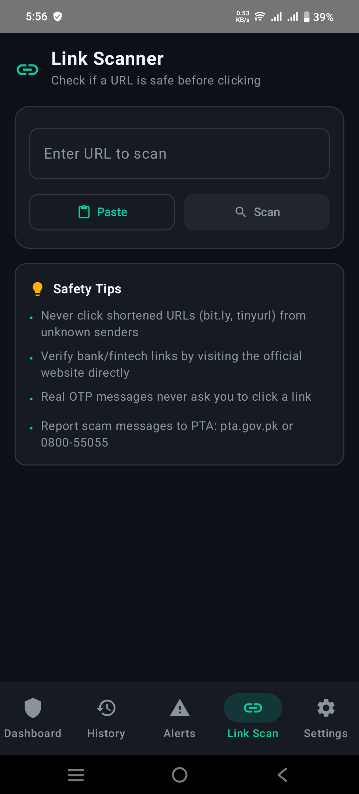
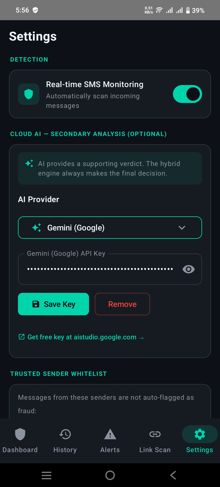
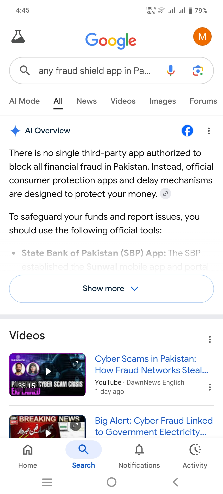
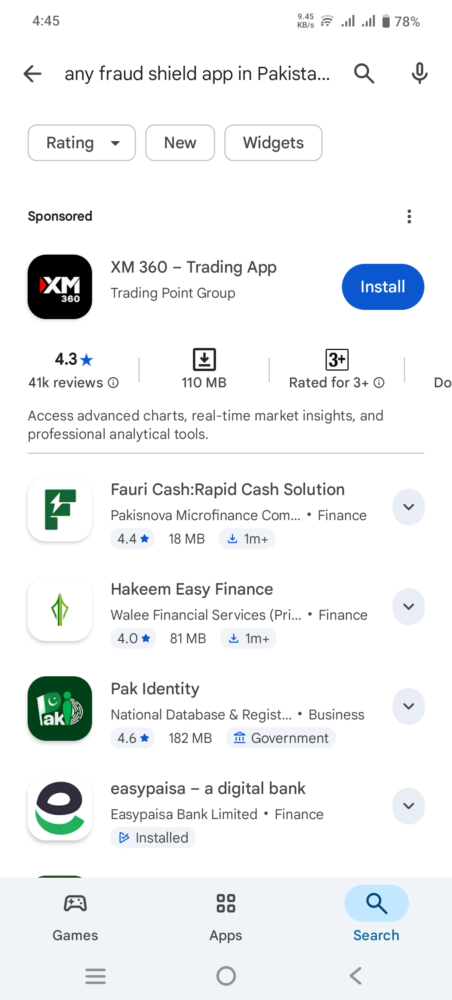

# FraudShield AI

> A real Android application that automatically detects fraudulent and suspicious SMS messages in real time — protecting Pakistani users from banking scams, phishing attacks, and financial fraud.

[](https://github.com/syedMoeenhaider1/Artificial-Intelligence-/raw/main/fraudshield.apk)
[](https://drive.google.com/file/d/1o1rUrMioG8_vU3o3H1lDmK_ajdWq9o_f/view?usp=drivesdk)

---

## App Screenshots

| Dashboard | Fraud Alerts | Scan History |
|:---:|:---:|:---:|
|  |  |  |

| Link Scanner | Settings |
|:---:|:---:|
|  |  |

---

## Why FraudShield AI is Unique in Pakistan?

> **Pakistan mein aaj tak koi dedicated AI-powered SMS fraud detection Android app available nahi thi — FraudShield is the FIRST of its kind!**

### Market Research Proof

We searched Google and Play Store for any similar app — **nothing was found:**




### What Makes Us Different?

| Feature | Other Apps | FraudShield AI |
|---|---|---|
| Auto SMS Detection | No | Yes |
| Real-time Fraud Alerts | No | Yes |
| AI Secondary Analysis | No | Yes |
| Pakistani Bank SMS Support | No | Yes |
| Scan History with Filter | No | Yes |
| Link Scanner | No | Yes |
| Trusted Sender Whitelist | No | Yes |
| Built for Pakistani Users | No | Yes |

---

## About The App

FraudShield is a native Android application that works by **automatically reading and scanning every incoming SMS message** in real time. The app uses a **Hybrid Detection Engine** — a local rule-based system makes the primary decision instantly, while an optional Cloud AI (Gemini by Google) provides secondary analysis for deeper accuracy.

The app has already scanned **1271 messages** and detected **6 suspicious** messages in real usage — proving it works on real Pakistani SMS data.

---

## Features

- **Dashboard** — Total scanned, dangerous, suspicious, and safe message counts at a glance
- **Auto SMS Detection** — Every incoming SMS is automatically scanned without any user input
- **Scan Existing Inbox** — Scan all existing messages in one tap
- **Fraud Alerts** — Dedicated alerts screen showing all suspicious and dangerous messages
- **Scan History** — Complete history of all scanned messages with filter by status
- **Link Scanner** — Check any URL before clicking — paste and scan instantly
- **Safety Tips** — Built-in Pakistani-specific safety tips (PTA reporting, OTP warnings)
- **Settings** — Real-time SMS monitoring toggle, AI provider selection, Trusted Sender Whitelist
- **Cloud AI Integration** — Optional Gemini (Google) AI for secondary deep analysis
- **Hybrid Engine** — Local engine makes final decision, AI provides supporting verdict

---

## Tech Stack

| Layer | Technology |
|-------|-----------|
| Platform | Android (Native) |
| Language | Java / Kotlin |
| UI | Android XML Layouts |
| AI Integration | Gemini API (Google) — Optional |
| Detection Engine | Hybrid (Local Rules + Cloud AI) |
| SMS Reading | Android BroadcastReceiver |
| Background Service | Android Foreground Service |
| Build Tool | Android Studio / Gradle |

---

## How It Works

### Automatic SMS Detection
1. App registers a **BroadcastReceiver** for incoming SMS
2. Every new SMS is instantly passed to the **Hybrid Detection Engine**
3. Local rule-based engine scans for fraud patterns immediately
4. If enabled, Gemini AI provides a supporting secondary verdict
5. Result stored in history — user notified if suspicious or dangerous

### Link Scanner
1. Copy any suspicious URL
2. Open app and go to **Link Scan** tab
3. Paste the URL and tap **Scan**
4. App checks for phishing patterns and unsafe domains instantly

---

## Download & Install

[](https://github.com/syedMoeenhaider1/Artificial-Intelligence-/raw/main/fraudshield.apk)

1. Click Download APK button above
2. Open the APK file on your Android phone
3. Tap **"Allow from this source"** if prompted
4. Tap **"Install"** and wait
5. Open **FraudShield** from home screen
6. Grant SMS and Notification permissions

---

## Android Permissions

| Permission | Purpose |
|---|---|
| RECEIVE_SMS, READ_SMS | Automatic real-time SMS detection |
| INTERNET | Cloud AI analysis (optional) |
| POST_NOTIFICATIONS | Fraud alert notifications |
| FOREGROUND_SERVICE | Background SMS monitoring |
| RECEIVE_BOOT_COMPLETED | Auto-start monitoring on reboot |

---

## Roadmap

### Completed
- [x] Real-time automatic SMS scanning
- [x] Hybrid detection engine (Local + AI)
- [x] Fraud Alerts screen
- [x] Complete scan history with filters
- [x] Link Scanner
- [x] Gemini AI integration
- [x] Trusted Sender Whitelist
- [x] Safety tips for Pakistani users

### Coming Soon
- [ ] Urdu language support
- [ ] Dark / Light theme toggle
- [ ] Weekly & monthly reports
- [ ] Google Pay & EasyPaisa integration
- [ ] Multi-bank pattern database
- [ ] Admin panel

---

## Project Structure

```
FraudShield-Android/
├── app/                    
│   ├── src/main/
│   │   ├── java/           ← Java/Kotlin source code
│   │   ├── res/            ← XML layouts and resources
│   │   └── AndroidManifest.xml
├── screenshots/            ← App screenshots
├── apk/
│   └── FraudShield.apk     ← Android APK file
├── README.md
└── LICENSE
```

---

## Documentation

- [User Manual](https://github.com/syedMoeenhaider1/Artificial-Intelligence-/raw/main/user_manual.pdf)
- [Project Presentation](https://github.com/syedMoeenhaider1/Artificial-Intelligence-/raw/main/ShieldGuard-AI_pdf.pptx)
- [License](LICENSE.txt)

---

## Developed By

| Name | Roll Number | GitHub |
|---|---|---|
| Syed Moeen Haider | BSCSE-23-49 | [syedMoeenhaider](https://github.com/syedMoeenhaider) |
| Abdullah Shaheryar | BSCSE-23-45 | — |

**Subject:** Artificial Intelligence
**Instructor:** Sir Faisal Hafeez

---

## License

MIT License — see the [LICENSE.txt](LICENSE.txt) file for details.

---

<div align="center">

FraudShield AI — Protecting Your Financial Future

---

Made with ❤️ by **Syed Moeen Haider** (BSCSE-23-49) & **Abdullah Shaheryar** (BSCSE-23-45)

**Project Instructor:** Sir Faisal Hafeez

[](https://github.com/syedMoeenhaider)
[](https://github.com/syedMoeenhaider1/Artificial-Intelligence-)

</div>
